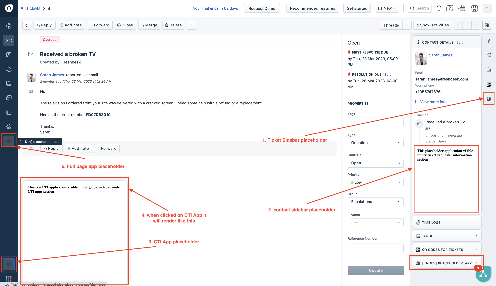

# Multi-placeholder App in Freshdesk
 
 In this step, we will modify the previous app to be visible in multiple placeholders within Freshdesk.

## Getting Started
1. Ensure you have followed the steps given in [getting started guide](../../step-1/getting_started.md)
2. Navigate to `common-starter-template` directory from CLI  
3. Run command `fdk run` to run the app
4. Navigate to your product page - https://[subdomain].[product].com/a/dashboard/sample Eg: https://paidappdemo.freshdesk.com/ 
   1. Navigate to a specific ticket - https://[subdomain].[product].com/a/tickets/[id] Eg.https://paidappdemo.freshdesk.com/a/tickets/3
   2. Append `?dev=true` or `&dev=true` in URI to include query param For example
   3. When to use when there is no query param in URI
    `https://paidappdemo.freshdesk.com/a/tickets/3?dev=true`
   4. To use when there is already a URI query param is present 
    `https://paidappdemo.freshdesk.com/a/tickets/3?current_tab=details&dev=true` 
5. Explore the app placeholders defined in manifest.json. The app must be visible under all of the defined placeholders

## Core Concepts Used

**Multiple Placeholders**: The app is configured to run in multiple placeholders within Freshdesk, allowing it to be accessible from various sections of the product interface.

Learn more about all [placeholders here](https://freshworks.dev/docs/app-sdk/v3.0/support_ticket/front-end-apps/placeholders/).

## How it works
1. The app manifest(`manifest.json`) is updated to include multiple placeholders where the app should be rendered. In this case we're using `ticket_sidebar`, `full_page_app`, `ticket_requester_info`, `cti_global_sidebar`, `contact_sidebar`, and `new_ticket_requester_info`.
2. When the app is accessed from any of these placeholders, it behaves consistently, displaying the requester's name as in the previous step.
3. The app listens to the `app.activated` event to know when a user opens the app in any of the defined placeholders.
4. On receiving the event, it fetches the ticket details using the `client.data.get('contact')` method.
5. Then it extracts the requester's name and displays it in a text element by the id `app_text` using DOM manipulation.

## Demos 

Here's how the app looks in different placeholders:

