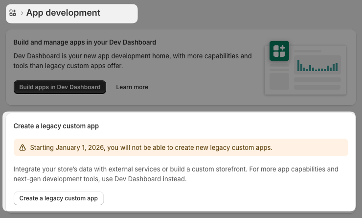
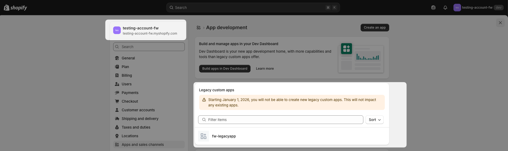
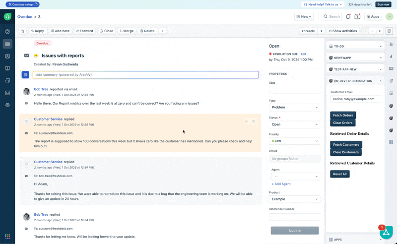

# Shopify Integration App
In this example, we'll learn how to build a Freshworks app that integrates with Shopify to fetch and display customer and order data.

This app provides users with 4 options using Shopify API
1. 'Fetch Orders' button, which when clicked, will call the `fetchCustomerOrders()` function.
2. 'Clear Orders' button, which when clicked, will call the `clearCustomerOrders()` function.
3. 'Fetch Customers' button, which when clicked, will call the `renderCustomerData()` function.
4. 'Clear Customers' button, which when clicked, will call the `clearCustomerData()` function

## Setting up Shopify Custom App
1. Create a Shopify account if you don't have one already.
2. Go to https://dev.shopify.com/ => Dev stores => Create store
3. Login to your Shopify dev store account => Settings => Apps and sales channels => Develop apps => Create a custom legacy app

4. Create your custom app by providing the App name and selecting the App developer

5. After creating the app, navigate to the "Configuration" tab to set the necessary API scopes for your app.
6. Click on "Configure Admin API scopes" and select the following scopes:
   - read_orders
   - read_customers
7. Save the changes to apply the selected scopes.
8. At the top right, click on "Install app" to install your custom app to the Shopify store.
9. Next, go to the "API credentials" tab to obtain your Admin API access token.
10. We'll use this key in our Freshworks app during installation.

# Demo 

