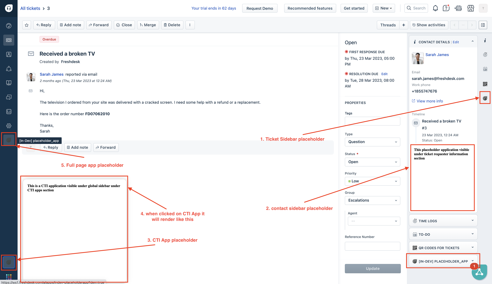

# Modify your app with app placeholders

The app manifest is modified to be visible in multiple places such as `ticket_sidebar`, `full_page_app`, `ticket_requester_info`, `cti_global_sidebar`, `contact_sidebar`, and `new_ticket_requester_info`.

1. Ensure you have followed the steps given in [getting started guide](getting_started.md)
2. Ensure you have built your first app using given [instructions](app-dev-guide.md)
3. Navigate to `your_first_app` directory from CLI
4. Update `manifest.json` to add placeholder information
5. Add views against each of placeholder, under `app/views/` and update the information of same in manifest
6. Run command `fdk run` to run the app
7. Navigate to your product page - https://[subdomain].[product].com/a/dashboard/sample Eg: https://paidappdemo.freshdesk.com/ 
   1. Navigate to a specific ticket - https://[subdomain].[product].com/a/tickets/[id] Eg.https://paidappdemo.freshdesk.com/a/tickets/3
   2. Append `?dev=true` or `&dev=true` in URI to include query param For example
   3. When to use when there is no query param in URI
    `https://paidappdemo.freshdesk.com/a/tickets/3?dev=true`
   4. To use when there is already a URI query param is present 
    `https://paidappdemo.freshservice.com/a/tickets/3?current_tab=details&dev=true` 
8. Explore the app placeholders defined in manifest.json. The app must be visible under all of the defined placeholders

## Expected outcome

When built app using mentioned steps your app must resemble to that of [placeholder_app](../apps/placeholder_app/)

When run using `fdk run` the app should be loaded as shown below

